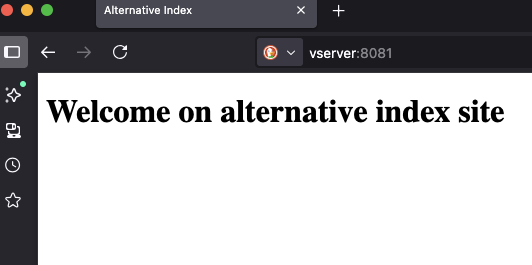
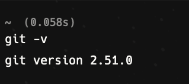
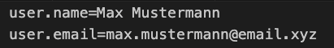

# Project V-Server Setup

## Goal

The goal of this project is to set up a V-Server. This includes passwordless SSH login, installation of NGINX including a custom index page, and a preconfigured Git.

## Table of content

1. [SSH](#SSH)
2. [NGINX](#NGINX)
3. [Git](#Git)
3. [Automation](#Automation)
4. [Tips](#Tips)

## SSH

### Create SSH key pair

To create a SSH Key pair use the following command:

```bash
ssh-keygen -t ed25519 -N "" -f <path/to/private-key/private-key-name>
```

> [!NOTE]
> Parameter -N "" is used for preventing a passphrase prompt.

### Upload SSH public key to V-Server

To upload the generated public key:

```bash
ssh-copy-id -i  ~/.ssh/da_vserver/da_vserver.pub <username>@<vserver-ip>
```

### Testing SSH connection

To test V-Server login via SSH key pair:

```bash
ssh -o "IdentitiesOnly=yes" -i  ~/.ssh/da_vserver/da_vserver <vserver-ip>
```

### Disable USERNAME/PASSWORD login

If the setup of SSH key pair, including login check was successful, disable USERNAME/PASSWORD login. For that adapt the config file of the SSH server.

> [!CAUTION]
> The config file is named sshd_config and can be found at /etc/ssh

Open the sshd_config file, search for:

```text
#PasswordAuthentication yes
```

uncomment this line and change yes to no.

```text
PasswordAuthentication no
```

> [!Tip]
> To check that login with username/password is not longer possible logout from V-Server and run following code

```bash
ssh -o PubkeyAuthentication=no '<username>@<v-server-ip>'
```

The message “Permission denied (publickey)” should be displayed.

***
> [!Tip]
> On the Host Machine:
> If you want add the following lines to the config file of the SSH client.[^1]
> The config file is named config and can be found at ~/.ssh

```text
Host <VServer-IP>
    User <SSH username>
    HostName <VServer-IP>
    IdentityFile <path/to/private-key/private-key-name>
```

[^1]: Pay attention to the indentation

***

## NGINX

> [!Note]
> All subsequent commands are executed on the V-Server.
> To do this, open a terminal and log in to the V-Server via SSH.

### Udate/Upgrade VServer Packages

```bash
sudo apt update && sudo apt upgrade -y
```

### Install NGINX

```bash
sudo apt install nginx -y
```

### Create alternate index.htnl

To create an alternative index.html create a folder named alternatives in /var/www/

```bash
sudo mkdir /var/www/alternatives
```

Then create a file named alternate-index.html in thid folder and open it with an editor[^2] of choice

[^2]: I use nano. If nano not is installed, install nano with: sudo apt install nano -y

> [!Note]
> You can create and open the file in one command

```bash
sudo nano /var/www/alternatives/alternate-index.html
```

Fill in some html code. For example see [alternate-index.html](remote_files/alternate-index.html)

Save and exit the editor by pressing STRG-O followed by pressing STRG-X

To tell NGINX to use this alternative index page, create a file named alternate in the /etc/nginx/sites-enabled directory.
To do this, you can also open the editor directly by specifying a file name. The editor will create the new file if it does not already exist.

```bash
sudo nano /etc/nginx/sites-enabled/alternate
```

For an example take a look at [alternatives](remote-files/alternates)  

> [!Note]
> The code in that file tells NGINX to listen on Port 8081 for incomming requests

Save and exit the editor by pressing STRG-O followed by pressing STRG-X

Then restart NGINX for the changes to take effect.

```bash
sudo systemctl restart nginx
```

To test the new configuration, open a brwoser and fill in following address and hit enter:

```text
<ip-address-of-vserver>:8081
```

The newly created alternative index page should be visible.



## Git

Check if git is installed or not

```bash
git --version
```

If git is installed the output of the command should look like this:



If git is not installed install git:

```bash
sudo apt install git -y
```

At least configure git to use your name and email

```bash
git config --global user.name "<username>"
git config --global user.email <my@email.address>
```

> [!CAUTION]
> The username has to be in quotation marks if the name contains spaces.

Check the config settings used by git

```bash
git config -l
```

The output should be like this:



## Automation

If you want to automate the setup (e.g., because you often want to set up servers with this configuration), automating the entire process is a good idea.

> [!CAUTION]
> The following process is primarily intended for experienced users. It is best to test the code locally on a VM beforehand to find any errors or even lock yourself out of the server.

> [!Note]
> The code in the scripts was tested on a Mac. The VM for testing was a Ubuntu Server 24.04.3 LTS on Parallels Desktop.
> Because of Mac some Shell commands are differend (syntax and formatting)

To automate the process I have created a shell script named `setup_prerequisites.sh` which does the following:  

- Input check (You have to input the username and ip for the V-Server as argument)
- Creation of SSH key pair
- Upload public key to V-Server
- Adaption of the inventory file (replace placeholder for name and ip)
- Adaption of a config file (ssh_configuration) for local SSH server (is being imported in ~/.ssh/config)
- Adaption of a shell script file (for later usage) to config git on V-Server
- Executing the Ansible Playbook

The Ansible Playbook is very basic with following tasks:

- Deactivating username/password login
- Update/upgrade package list and packages
- Installation of NGINX
- Upload the alternative index page
- Configuration of NGINX to use the new index page
- Execution of the git_config script to configure git

## Tips

Create an alias for the SSH connection so you don't need typing the whole command.

```text
Replace username with your username of the V-Server and vserver-ip with ip or domain of the V-Server
vssh=ssh <username>@<vserver-ip>

eg.:
vssh=ssh mustermann@1.2.3.4
```

To avoid having to enter the IP address of the vserver every time, use DNS. To do this, edit the hosts file and map the IP to a name there.

```text
<vserver-ip> <vserver>

eg.: 
1.2.3.4 myserver
```
